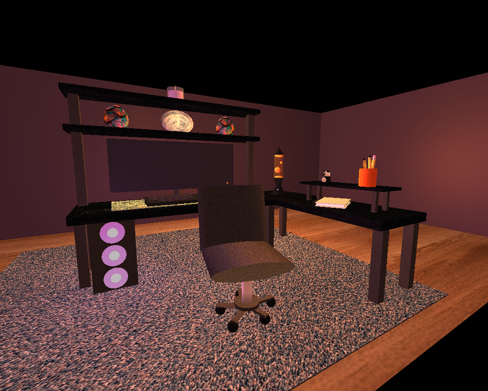

# CS-330-OpenGL-3D-Scene

This repository contains a portfolio artifact from CS 330: Computational Graphics and Visualization at Southern New Hampshire University. The included project demonstrates my ability to design and implement a fully realized 3D scene using OpenGL, applying concepts such as transformations, lighting, texturing, and camera controls.

The artifact focuses on building a detailed and interactive 3D environment by combining simple geometric shapes into complex objects. The project emphasizes scene composition, realistic lighting techniques, and user-controlled navigation to create an immersive visual experience.

Skills Demonstrated: OpenGL Rendering • 3D Transformations • Lighting (Ambient, Diffuse, Specular) • Texture Mapping • Camera Controls • Scene Composition • Modular Programming

## Project Preview

---

## Reflection Journal

Throughout this project, my approach to designing software became more intentional and structured. Instead of focusing only on making something functional, I began thinking about how the final product should look, feel, and be experienced by the user. One of the most important design skills I developed was the ability to break down a complex scene into smaller components and build each object from simple geometric shapes. This helped me better understand how to plan and organize a design before implementing it. I followed an iterative design process, starting with a basic layout and gradually adding more detail, such as textures, lighting, and additional objects. This approach allowed me to continuously refine my work, and I can apply these same tactics in future projects by starting simple and building complexity over time.

When developing programs, I learned to rely more on organization and modularity. I created separate functions for different responsibilities, such as object creation, transformations, and lighting, which made the code easier to manage and debug. I also used new development strategies, such as testing changes frequently and adjusting small pieces of the scene rather than making large changes all at once. Iteration played a major role in my development process, as I constantly tested camera movement, lighting adjustments, and object placement to improve the scene. Over the course of the milestones, my approach evolved from trial-and-error to a more thoughtful and planned process where I considered the outcome before coding.

This project also reinforced how computer science can support my long-term goals by combining creativity with technical problem-solving. Through computational graphics and visualization, I gained practical experience with 3D transformations, lighting models, and scene organization. These skills are valuable in my educational pathway as I continue learning more advanced graphics and programming concepts. Professionally, they can be applied to areas such as game development, simulation, or interactive software design. Overall, this project helped me build both technical skills and a stronger approach to designing and developing software.
